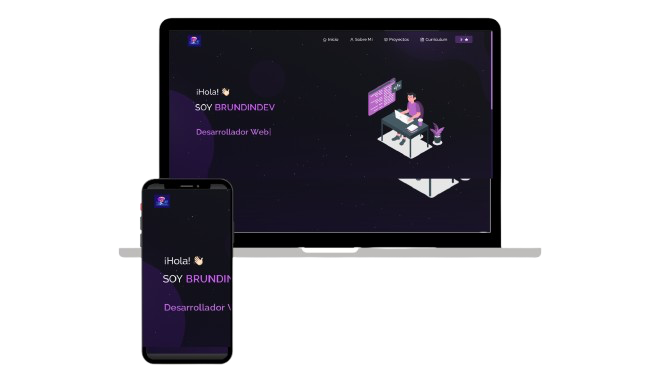

<h2 align="center">
  Portfolio @brundindev - v1.0 
  <a href="https://brundindev-portfolio.vercel.app/" target="_blank">brundindev.es</a>
</h2>

  

 

 &nbsp;
 &nbsp;
 &nbsp;
 &nbsp;

<h3 align="center">
    🔹
    <a href="https://github.com/brundindev/Portfolio/issues">Reportar Bug</a> &nbsp; &nbsp;
    🔹
    <a href="https://github.com/brundindev/Portfolio/issues">Solicitar Funcionalidad</a>
</h3>

## Resumen

Puedes hacer un fork de este repositorio para modificarlo y hacer tus propios cambios. Por favor, dame el crédito correspondiente enlazando a [brundindev](https://github.com/brundindev/Portfolio). ¡Gracias!

## Construido Con

Mi portfolio personal <a href="https://brundindev-portfolio.vercel.app/" target="_blank">brundindev.es</a> muestra algunos de mis proyectos de GitHub, así como mi currículum y habilidades técnicas. 

Este proyecto fue construido utilizando las siguientes tecnologías:

- React.js
- CSS3
- VsCode
- Vercel

## Características

**📖 Diseño Multi-Página**

**🎨 Estilizado con React-Bootstrap y CSS con colores fácilmente personalizables**

**📱 Completamente Responsive**

### Muestra tu apoyo

¡Dale una ⭐ si te gusta este sitio web!

# Portfolio
